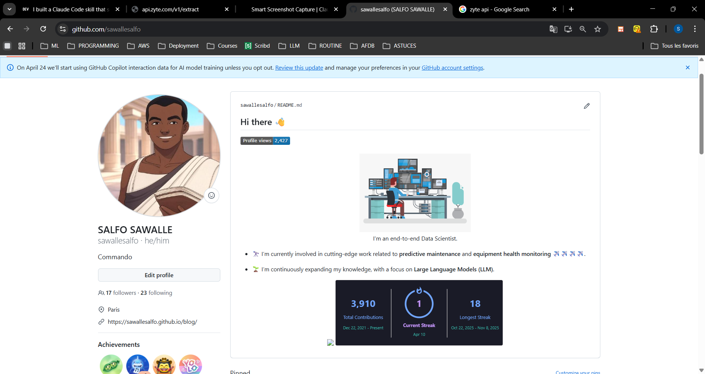

# claude-skills

A plugin marketplace for [Claude Code](https://claude.ai/code) — technical documentation, architecture diagrams, and engineering workflows.

---

## Available Plugins

| Plugin | Description |
|--------|-------------|
| [`arch-diagram`](./plugins/arch-diagram/) | Generate technical architecture diagrams as SVG + PNG (pipeline flows, swimlanes, system diagrams) |
| [`screenshot`](./plugins/screenshot/) | Capture full-page screenshots of any public URL using Playwright headless Chromium — no API key required |

---

## Installation

### Step 1 — Add the marketplace

```
/plugin marketplace add sawallesalfo/claude-skills
```

### Step 2 — Install a plugin

```
/plugin install arch-diagram@sawallesalfo-claude-skills
```

### Step 3 — Reload plugins

```
/reload-plugins
```

That's it. Once installed, just describe what you want — Claude will use the skill automatically:
> *"Create an architecture diagram for our data pipeline"*
> *"Draw a swimlane diagram showing the user authentication flow"*

### Alternative — Copy skill manually

If you prefer not to use the marketplace, copy the skill directly:

```bash
# Into your project (shared with team)
mkdir -p .claude/skills
cp -r plugins/arch-diagram/skills/arch-diagram .claude/skills/arch-diagram

# Or globally (personal, all projects)
mkdir -p ~/.claude/skills
cp -r plugins/arch-diagram/skills/arch-diagram ~/.claude/skills/arch-diagram
```

---

## How It Works

Each plugin contains a `SKILL.md` file that Claude reads when the task matches its description. Plugins can also include:

- `references/` — documentation loaded into context as needed
- `scripts/` — reusable scripts Claude can run
- `assets/` — templates, examples, fonts

```
plugins/
└── arch-diagram/
    ├── .claude-plugin/
    │   └── plugin.json          <- plugin manifest
    ├── skills/
    │   └── arch-diagram/
    │       └── SKILL.md         <- instructions + metadata
    ├── references/
    │   └── branding.md          <- company color palettes
    ├── scripts/
    │   └── svg_to_png.py        <- SVG -> PNG conversion
    └── assets/
        ├── example.svg
        └── example.png
```

See the [Agent Skills spec](https://agentskills.io) and [Anthropic's documentation](https://support.claude.com/en/articles/12512176-what-are-skills) for more details.

---

## Usage Examples

### Screenshot

After installing `screenshot`, ask Claude:

> *"Take a screenshot of https://github.com/sawallesalfo"*

Claude will capture the page with Playwright and save it as a PNG:



### Architecture Diagram

After installing `arch-diagram`, ask Claude:

> *"Draw a 3-lane swimlane diagram for our document ingestion pipeline: sources -> processing -> storage. Use the green & gold palette from branding.md."*

Claude will generate an SVG, export a 2x PNG, and report both paths.

---

## Contributing

Plugins are plain Markdown — no build step, no dependencies. To add a plugin:

1. Create a folder under `plugins/your-plugin-name/`
2. Add `.claude-plugin/plugin.json` and `skills/your-skill-name/SKILL.md`
3. Register it in `.claude-plugin/marketplace.json`
4. Open a PR

---

## License

MIT — see [LICENSE](./LICENSE).
